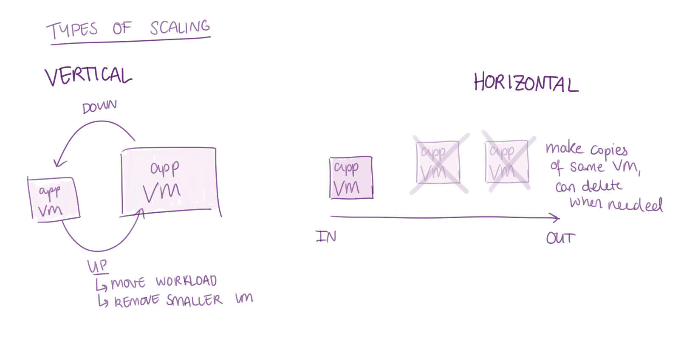
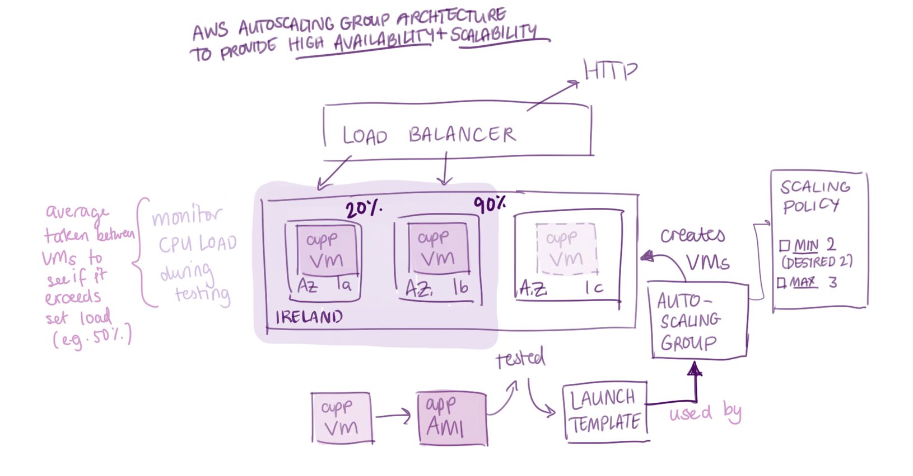

- [Two types of Auto Scaling:](#two-types-of-auto-scaling)
- [1. Vertical:](#1-vertical)
- [2: Horizontal:](#2-horizontal)
- [AWS Auto Scaling:](#aws-auto-scaling)

## Two types of Auto Scaling:

## 1. Vertical:

* Imagine you have a big app VM, it normally has a bigger disk, larger memory. 
* You either "scale down" to a smaller app VM or "scale up" to a larger app VM.
* You will be able to choose a size and it will create a size of that VM accordingly.
* For example, if you "scale big", it moves the workload from the small VM to the big VM, ensuring that the small VM is then removed.
* Not used in AWS.

## 2: Horizontal:

* Imagine you have a small app VM, as the workload increases, more machines will be made to also run antoehr instance of the app. 
* Mostly, the machines created will be identical but not necessary. 
* This can me done manually or also automatically.
* This is referred to "scale in" if only one machine is necessary and "scale out" if more machines are made.
* This allows the app to handle the work load and also if one machine goes down, it would not caouse too much problems as there are other machines too. Also, you can send traffic to VM.

## AWS Auto Scaling:

* When you have an app VM, and you create an app AMI and test it, you make a launch template.
* A launch template is necessary for and used by the autoscaling group. 
* This will then create the VMs, avoiding the traffic.
* For example, since our location is Ireland, three things we need to remember the availabilty zones (1a, 1b, 1c).
* AWS Auto Scaling Group architecture to provide (High Ability)HA + (Scalability)SC.
* Scaling Policy: in each availabilty zone, there will be one app VM. In minimum, there will always be 2 VMs in each availability zone. And desired 2VM.
* Maximum VM will be 3. This is so that workload can be evenly distributed if the other 2 are too full. 
* Ideally, the CPU load will only be able to handle 2 VM. (In example). 
* This could be related to the app that is trying to get used by users. 
* For example: If VM1 has 20% work load, VM2 has 90% workload and CPU has a distribution of 50%, then a new VM would be created (20+90/2) = 55%. So new instance will be created. 
* The load balancer will be distributing the work laod across the VMs to make them "healthy". This will be created from the internet (HTTP).
* There will always be 2 in case one stops working. This is so that the workload still gets balanced out and spread across the availability zones. 

Steps to create Auto Scaling in AWS:

1. First create a launch template:
   * Launch template name: tech511-afsheen-for-asg-sparta-app-lt
   * Go down to Application and OS images (Amazon Machine Image) and select 'My AMIs'.
   * Then click the (default) option "Owned by me".
   * Click your AMI you created for the app (ready to run app).
   * Instance type: t3 micro.
   * Key pair: tech511-afsheen-aws.
   * Security group: pick your HTTP one
   * Enter User Data:
  
        #!/bin/bash

        cd home/ubuntu/tech511-sparta-app/app

        pm2 start app.js
   
   * After launching the template, test it to make sure it works. 
   * Hover over the "Actions" button and click "Launch instance from template".
   * Notice how everything is filled in before creating an instance, saving time. 
   * Launch the instance and click on the public IP address to see if you are able to see the starting page of the Sparta App.
   * May need to wait for 4-5 secs or so for the whole app provision script to run.
   * This is because the whole VM has to be created, and then it has to boot up the app and then finally run the app. 
   * But in this case, since we only put in a few commands from the app prov script, it only needs about 40 secs or so to run. 

2. Then create an Auto Scaling Group:
   * Click on the "Auto Scaling Groups" tabs on the left right at the bottom.
   * Then click "Create Auto Scaling Group" at the top right.
   * Write "tech511-afsheen-sparta-app-asg" in the Auto Scaling group name.
   * Select your launch template that you've just created: tech511-afsheen-for-asg-sparta-app-lt.
   * Click next.
   * Let it be the default VPC and select the 3 availability zones (DevOps Student 1a, 1b, 1c). (eu west).
   * Then press next.
   * Click "Attach to a new load balancer".
   * Keep it as "Application Load Balancer".
   * Load Balancer name: tech511-afsheen-sparta-app-asg-lb
   * Keep the Load Balancer Scheme to "Internet-facing".
   * In the "Listeners and routing" section, click "select new or existing target group" for the "default routing (forward to) section. Then click "create a target group".
   * New target group name: tech511-afsheen-sparta-app-asg-lb".
   * Change the "Health check grace period" to 120 secs.
   * Then click on the recommended health check and finally click "next".
   * Might need to do some editing to the target group name due to the excessive number of characters used.
   * On the "Group size", type in 2 as the "desired capacity", 2 for the "min desired capacity" under "scaling" and 3 as the "maximum desired capacity".
   * Click the "Target tracking scaling policy", and change the "target value" to 50, and the "Instance warmup" to 120 secs again. 
   * Add a tag. 
   * Write "Name" in Key and "tech511-afsheen-sparta-app-HA-SC" in Value.
   * After it gets created, click on the auto scaling group, and click on the instance under "instances management" to check if they're working and showing the app. 
   * Click on the "load balancing target group" link under "Integrations - new" tab.
   * When you have healthy instances, it means everything is good. 
   * When you go to the target group, you can see the distribution of work load under "Distribution of targets by Availability Zone (AZ)".
   * Once you click on the Load balancer link, click the DNS link and that will get a public IP address and connect to the app. 
  
* Click on instances, find your instances and terminate them.
* If you terminate one of them, there might be a slight interuption but another instance will be made and run the app. This is because we selected 2 as minimum. 

How to delete auto scaling groups: 

1. First delete load balancer. May need to confirm.
2. Then delete target group. 
3. Then delete auto scaling group by going on auto scaling group, selecting it and terminating it. Will need to confirm deletion.
4. Leave the app and db AMI but delete the instances. 