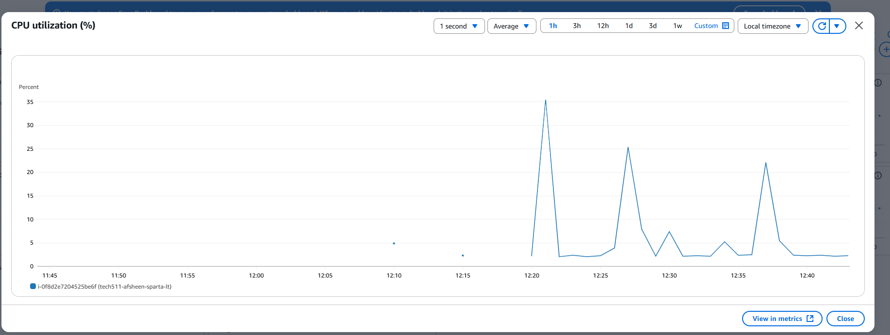
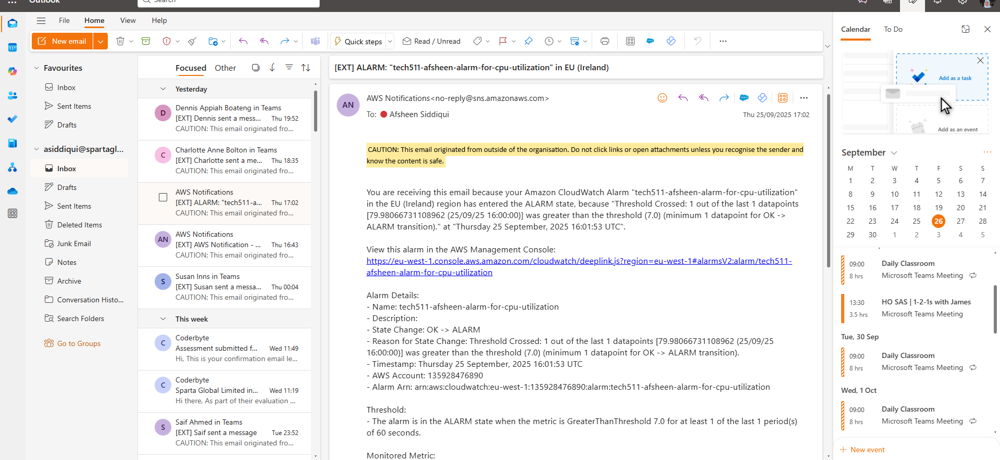

# AWS S3

## What is AWS S3?

* Simple Storage Service
* Stored in the cloud
* Used to storage & retrieve any data amount of data, anytime, from anywhere (with and internet connection).
* Can be figured easily to host a static website.
* Built-in redundancy: saving files in multiple places. Default is 3 copies, 1 in each AZ (availability zone).
* Access it in many ways, including CLI.

# Code-along Notes
1. Start the instance and SSH in to a git bash terminal.
2. After that, log into the terminal as a 'ubuntu' user.
3. If machine hasn't been updated, do so with this command: 
   * sudo apt update -y && sudo apt upgrade -y
4. Check Python version:
   * python3 --version
Should be Python 3.10.12
5. Then install pip:
   * sudo apt install python3-pip
6. Then install AWS CLI:
   * sudo pip install awscli
7. Then check aws version:
   * aws --version
Should be aws-cli/1.42.38 Python/3.10.12 Linux/6.8.0-1039-aws botocore/1.40.38
8. Type in 'aws configure' to authenticate into aws and enter the Access Key from the excel sheet in the .ssh folder named 'afsheen_accessKeys'
9. Then add the Secret Acess key it asks from the excel sheet.
10. Then add the region. This is eu-west-1.
11. It then asks for the 'default output format'. Put in 'json'.
12. Type in 'aws s3 ls' to see the buckets. This will make sure your access keys work. 
13. If you want help, type in 'aws s3 help'.
14. To make a bucket and name it, we type in 'aws s3 mb s3://tech511-afsheen-first-bucket'.
15. Do 'aws s3 ls' to make sure it's there. 
16. Do 'aws s3 ls s3://tech511-afsheen-first-bucket' to check everything in there. Obviously nothing is in there so just got the command line back.
17. To create a file in the bucket, type:
    * echo what an awesome file this is! > test.txt
    * verify with: cat test.txt
18. Upload file into bucket: 
    * aws s3 cp <filename> s3://<bucket name>
    * aws s3 cp test.txt s3://tech511-afsheen-first-bucket
    * Should get this output: upload: ./test.txt to s3://tech511-afsheen-first-bucket/test.txt
19. Check file in bucket:
    * aws s3 ls s3://tech511-afsheen-first-bucket 
    * Should get: 2025-09-25 14:20:22         30 test.txt
20. Create a new directory called 'download' to download a file to the bucket
    * mkdir downloads
    * cd downloads
    * Saving it in the current directory with the .
    * 'aws s3 sync s3://tech511-afsheen-first-bucket .' 
21. Deleting a single file from the bucket
    * aws s3 rm s3://<name of bucket>/<name of file to remove>
    * aws s3 rm s3://tech511-afsheen-first-bucket/test.txt
    * Should get: delete: s3://tech511-afsheen-first-bucket/test.txt
    * Do 'aws s3 ls s3://tech511-afsheen-first-bucket' if file is deleted.
22. Uploading a file into the bucket:
    * aws s3 cp test.txt s3://tech511-afsheen-first-bucket
    * Should get 'upload: ./test.txt to s3://tech511-afsheen-first-bucket/test.txt'.
23. Deleting all files from the bucket:
    * aws s3 rm s3://tech511-afsheen-first-bucket --recursive (DANGEROUS)
    * Should get: delete: s3://tech511-afsheen-first-bucket/test2.txt
    delete: s3://tech511-afsheen-first-bucket/test.txt
24. Delete bucket (DANGEROUS! Will also delete files without confirmation):
    * aws s3 rb s3://<bucket name>
    * aws s3 rb s3://tech511-afsheen-first-bucket
    * If bucket is not empty, you will get this warning: 'remove_bucket failed: s3://tech511-afsheen-first-bucket An error occurred (BucketNotEmpty) when calling the DeleteBucket operation: The bucket you tried to delete is not empty'
    * If you want to remove the bucket with the files, then: 
    * aws s3 rb s3://tech511-afsheen-first-bucket --force
    * Should get: delete: s3://tech511-afsheen-first-bucket/test.txt
    remove_bucket: tech511-afsheen-first-bucket
    * If you do ls: 
    * An error occurred (NoSuchBucket) when calling the ListObjectsV2 operation: The specified bucket does not exist

## Code - along notes to create dashboard
1. First create an instance from our existing AMI by going on "launch template".
2. Every rule must be kept the same except add a key-pair value. Remember "Name" for key and then as the value I've kept "tech511-afsheen-sparta-lt". This will be you instance name too.
3. Check the app is working by clicking on the public IP address. May need to wait for a while. Did get 502 bad gateway error and just kept reloading the page.
4. Then connect SSH to a new git bash terminal. You may be told to log in as an Ubuntu user. 
5. Update the dependencies by typing this command: 
   * sudo apt update -y && sudo apt upgrade -y
6. Then install apache to allow you to load test the VM:
   * sudo apt-get install apache2-utils
7. Then in your instance details, scroll down to "Monitoring" and create a new dashboard. 
8. To do this, click on the 3 dots on the right and a new tab will open to create a new dahsboard. Name it and press "create" first, then confirm.
9. On the top right, where it says "Manage detailed monitoring", a tab of "detailed monitoring" will open and you click "enable". 
10. Then edit the configurations to 1 min, every 1 hour. We looked at "CPU utilization".
11. Then on the git bash terminal, type this command and see the spikes in the graph.
   * ab -n 1000 -c 100 http://yourwebsite.com/
   * code means to make 1000 requests in 100 requests at a time. 
   * Put in public IP address.
   * This is used to get us the CPU load metric. 
   * We can identify this by managing the CPU workload and make sure we don't go overloading the machine and setting a threshold. 

## CPU Usage Alarm Notes

Follow this to help create an alarm: 
https://docs.aws.amazon.com/AmazonCloudWatch/latest/monitoring/US_AlarmAtThresholdEC2.html

* I created the theshold as 7. 

## Extra Notes
* Would not be good to use AWS S3 if you need someone to edit files and need some sort of a locking mechanism on the files. 
* Would only have 'read' access even as the creater of the bucket. This is because we are logged in as a root user. Remember that if we were logged in as an 'ubuntu' user, we may have full access.