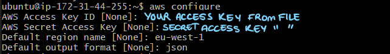

## How to install dependencies for AWS CLI on your EC2 instance
1. You can run the  msiexec command to run the MSI installer.
`C:\> msiexec.exe /i https://awscli.amazonaws.com/AWSCLIV2.msi`
2. For various parameters that can be used with msiexec, see msiexec on the Microsoft Docs website. For example, you can use the /qn flag for a silent installation.
`C:\> msiexec.exe /i https://awscli.amazonaws.com/AWSCLIV2.msi /qn`
3. To confirm the installation, open the Start menu, search for cmd to open a command prompt window, and at the command prompt use the aws --version command.
`C:\> aws --version`
aws-cli/2.27.41 Python/3.11.6 Windows/10 exe/AMD64 prompt/off

## How to authenticate using AWS CLI
### In order to authenticate using our EC2 instance metadata as credentials in the AWS CLI, we have to:
1. Create a profile in your configuration file.
`[profile profilename]`

2. Add your IAM arn role that has access to the resources needed.
`role_arn = arn:aws:iam::123456789012:role/rolename`

3. Specify Ec2InstanceMetadata as your credential source.
`credential_source = Ec2InstanceMetadata`

4. Set your Region.
`region = region`

Example

The following example assumes the marketingadminrole role and uses the us-west-2 Region in an Amazon EC2 instance profile named marketingadmin.

[profile marketingadmin]
role_arn = arn:aws:iam::123456789012:role/marketingadminrole
credential_source = Ec2InstanceMetadata
region = us-west-2

## How to manipulate S3 storage on AWS
https://docs.aws.amazon.com/cli/v1/userguide/cli-services-s3.html

## S3 Storage Task Notes
* I created a new VM instance with the existing SG's (for the app) and no user data. Once I created that, I SSH'd into a Gitbash terminal and downloaded AWS CLI:
1. `sudo apt update && sudo apt upgrade -y`
2. `sudo apt install -y python3 python3-pip unzip curl`
3. `sudo install unzip`
4. `curl "https://awscli.amazonaws.com/awscli-exe-linux-x86_64.zip" -o "awscliv2.zip"`
5. `unzip awscliv2.zip`
6. `sudo ./aws/install`
7. Check installation: `aws --version`
8. Install boto3: `pip install boto3`
9. Configure AWS Credentials: `aws configure`
10. 
11. Verfiy: `aws s3 ls`
12. Then create all the python3 scripts and run them with `python3 filename.py`

## Adding an S3 image to the Sparta Test app
1. Environment Setup
* Launch EC2 instance (Ubuntu) or use app AMI. Use existing app SG.
* Install AWS CLI:
`sudo apt update`
`sudo apt install awscli -y`
`aws --version`
2. Login to AWS CLI:
`aws configure`
3. Enter your AWS Access Key, Secret, region (eu-west-1), and output format (json).
4. Preparing the Cat Image:
* Cat image downloaded manually from your PC (cat.jpg) to Downloads.
* Transferred to EC2 instance using SCP:
`scp -i "~/.ssh/tech511-afsheen-aws.pem" "C:\Users\affsi\Downloads\cat.jpg" ubuntu@<EC2-IP>:/home/ubuntu/`
* Moved cat image to app images folder:
`sudo mv /home/ubuntu/cat.jpg /tech511-sparta-app/app/public/images/`
5. Fixed file ownership and permissions:
`sudo chown -R ubuntu:ubuntu /tech511-sparta-app`
6. Preparing use-s3img-on-homepage.sh
## Purpose:
* Stop app
* Create S3 bucket
* Upload cat image
* Backup index.ejs
* Replace homepage logo with cat image
* Restart app
## Key changes/fixes made:
* Updated the logo reference to match actual app logo squarelogo.jpg.
* Fixed PM2 restart issues by using absolute paths and proper folder (/tech511-sparta-app/app).
* Skipped ACLs/public access since image display wasn’t needed externally.
* Script path: /tech511-sparta-app/app/use-s3img-on-homepage.sh
## Run:
`chmod +x use-s3img-on-homepage.sh`
`./use-s3img-on-homepage.sh`

## Blockers encountered:

* 1. Permission errors when copying/creating backups:
    * Fixed with sudo chown -R ubuntu:ubuntu /tech511-sparta-app.
* 2. Bucket already exists:
    * Handled with || echo "Bucket already exists".
* 3. App 502 Bad Gateway:
    * PM2 had no registered app; fixed by starting the app manually once:
        `pm2 start app.js --name sparta-app`
* 4. Cat image didn’t show
    * Fixed by replacing /images/squarelogo.jpg instead of /images/logo.png in index.ejs.

7. Preparing revert-to-normal-homepage.sh
## Purpose:
* Stop app
* Restore original index.ejs from backup
* Restart app
* Remove S3 cat image and bucket

## Key fixes:

* Added cd "$APP_DIR" at the top to ensure PM2 runs in correct folder

* Handled missing backup and bucket gracefully

* Script path: /tech511-sparta-app/app/revert-to-normal-homepage.sh

## Run:
`chmod +x revert-to-normal-homepage.sh`
`./revert-to-normal-homepage.sh`

## Blockers encountered:
* 1. PM2 error: Script not found
  * Fixed by cd /tech511-sparta-app/app in the script before starting PM2.

* 2. Permission issues (already fixed in previous step).