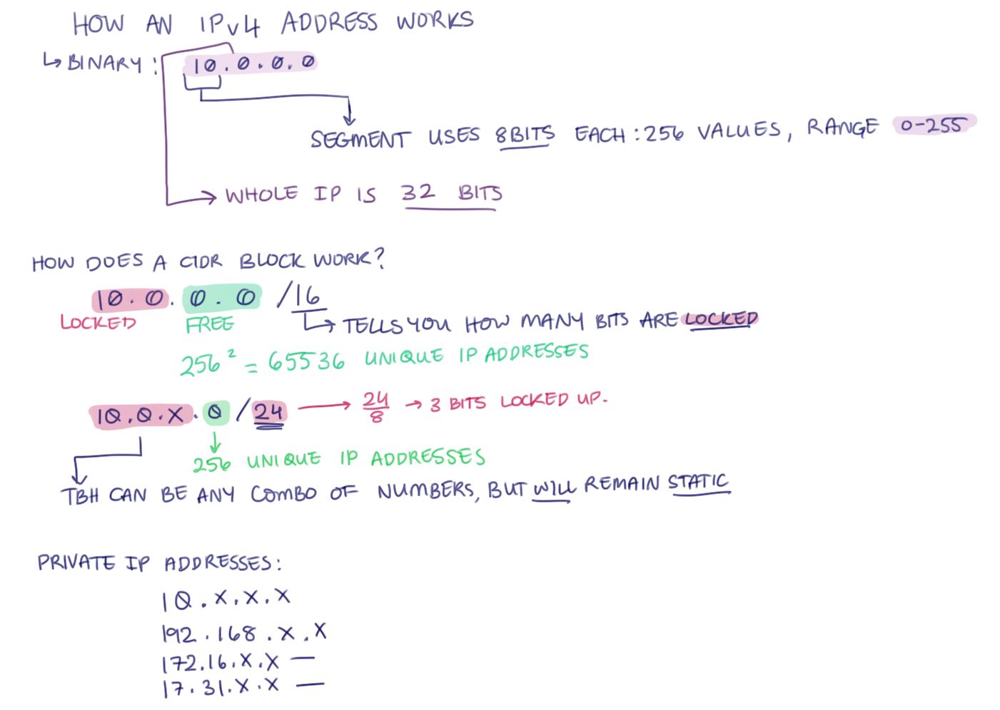
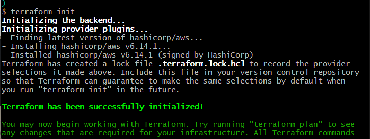

### Install Terraform on laptop
* Test with terrafrom --version on Gitbash
* Output should be similar as:
terraform --version
Terraform v1.6.4
on windows_amd64

* Make sure you can run terraform command from anywhere i.e. in a Git Bash (Windows) or terminal (MacOS)
* Move the terraform.exe to a logical place e.g. C:\Hashicorp\Terraform
* Add the location to the PATH environment variables

PATH: C:\ProgramData\chocolatey\lib\terraform\tools

REMEMBER TO EXPLAIN WHY WE DID CERTAIN THINGS AND WHAT APPLICATIONS WE USED TO COMPLETE IT.
WHAT PROBLEM WE SOLVED.

### How an IPv4 address works
* Each bit it called a segment.
* In binary, there are 8 bits.
* There are 256 IP addresses we could have. (2^8).
* There are 4 segments in 10.0.0.0 which means there are 32 bits. 

### How a CIDR block works

* 10.0.0.0/16 means a CIDR block with the /16.
* 10.0 have a total of 16 bits altogether and is locked.
* The rest of the bits can be changed.
* Each bit has 256 possible values. 
* If it is 10.0.0.0/16 then we can have a range of IP addresses.
* For the IP address, 10.0.0.0/24, the first 3 IP addresses are locked (10.0.0). The last bit could be changed.
* Also has 256 possible IP addresses
* If the IP address is 10.0.0.0/24, it means there is only 1 bit that could be changed.

Private IP addresses:
* 10.x.x.x
* 192.168.x.x
* 172.16.x.x - 17.31.x.x -> range of possible private IP addresses.
* If range exceeds this, then it will be a public IP address.

## Intro to IaC

## What problems need solving?
* We are still manually "provisioning" the servers.

What do we mean by "provisioning"?

* The process of setting up and configuring servers.

 

## What have we automated so far?
* VMs
  * Creation of VMs? Not automated.
  * Create infrastructure they live in (e.g. Vnet)? Not automated
  * Setup & configuring of software on VMs? Yes, how? 
    * User data
    * Bash scripts
    * AMIs 

## Solving Problem

Infrastrucutre as Code (IaC) can do the provisioning of:
  * infrastrucutre itself (servers).
  * configure the servers ie.e installing software & configuring settings.

### What is IaC?

* A way to manage and provision computers through a machine-readable definition of the infrastructure.
* Usually you codify WHAT you want (declarative: you define the outcome/ desired state (idempotent)), not HOW to do it (imperative).
* For example Python is imperative. 
 
  
### Benefits of IaC

* Speed + simplicity
  * Reduce the time to deploy your infrastructure
  * Everything you need will already be created for you like route table, Internet gateway, VPC, instance.
  * You simple describe the end state, and the tool works out the rest.
* Consistency & accuracy
  * Avoid human error trying the create/maintain the same infrastructure.
  * Version Control
    * Keep track of version of infrastructure
  * Scalability
    * Easy to scale or duplicate the infrastructure (including for different environments)   
     
### When/where to use it

* Use good judgement - will automating your infrastructure be worth the invest time.

### Tools available for IaC/ Types of IaC tools
Two types of IaC tools:
1. Configuration Management tools - best for installing/configuring software.
    Examples:
       * Chef 
       * Puppet
       * Ansible 
2. Orchestration Tools - best for managing infrastructure e.g. creating/deleting VMs, Security Groups, route tables, anything that needs creating.
    Examples:
        * CloudFormation (AWS)
        * Terraform
        * ARM/Bicep templates (Azure)
        * Ansible (can do this, but best for configuration management) -> can ask AWS to create template but is best for configuration management.

## CLI commands to create an EC2 instance using Terraform
1. First initiate terraform: terraform init
2. Once we added the code in the main.tf and tried initialising again, we got:
   
3. Then do 'terraform plan': this will add the test instance. Non-destructive command.
4. Then do 'terraform apply': this will apply any changes made in the script. Enter yes when it asks to enter a value.
5. Did 'terraform plan' to make some quick changes to the instance name.
6. Once I entered 'yes' as a value again, and reloaded AWS, I managed to find the instance.
7. To delete/terminate the instance, type in 'terraform destroy'

DESTRUCTIVE CODES ON TERRAFORM:
1. terraform destroy
2. terraform apply