# Intro to Ansible

# What is Ansible?

* A configuration management tool - best for installing/configuring software.
* Red Hat leads development
* Open-source
* Written in Python
* Started with a few core modules that managed Linux servers
* Application deployment
* Works with almost any system
  * Linux & Windows servers
  * Routes and switches
  * Can configure Cloud services
  
## How does it work?
* Think of a recipe as a code and Ansible as a robot that follows the recipe.
* Recipes (the actions/tasks/instructions) are written in YAML called "playbooks".
* Ansible control node tells the target node what to do.
* agentless:
  * No need to install Ansible or any agents that needs to be installed in the target node that needs configuring.
  * Instead, using SSH to access target nodes and it also needs Python interpreter on Linux target nodes.

## How Ansible Architecture works:
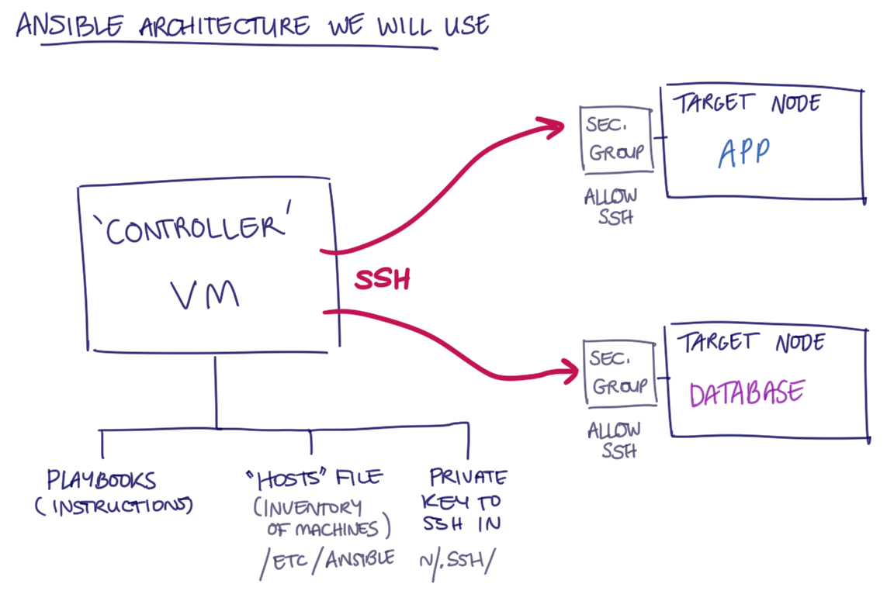
* We will be having a "Controller" VM, and then 2 target nodes. Each target node will run one VM. One app VM and one DB VM.
* The "Controller" will all the software required to configure the target nodes.
* The "Controller" VM will be SSH'ing into both the VMs.
* In order to SSH, we need to give Ansible our private key.
* The "controller" VM will have 2 files names "playbooks" and "inventory"(not necessarily the name of the file) to allow the tasks to be done. The inventory will have a "host" file.
* To be able to tell us what the target nodes need to be able to configure, we have the private IP address that lets the app connect to the database.
* The playbooks will allow the target nodes (VMs) to run.
* To find the host file, it will be in `/etc/ansible`.
* The private key needed to SSH in will be put in a .SSH folder inside the "controller" VM. Path is `~/.ssh`.
* Both target node VM's will have to allow SSH as the security group from the controller VM. Make sure it is from the "Controller" only and not "from anywhere". Needs to allow port 22.

## Hosts file first entry

ec2-instance ansible_host=54.154.182.31 ansible_user=ubuntu ansible_ssh_private_key_file=~/.ssh/tech511-afsheen-aws.pem

* The pem file is used to SSH into the instances.
* The ping file is for knowing if the instance is live and responding.
* The ping command will make the "controller" VM SSH into the other instances and check if the communication between them is good. 
* 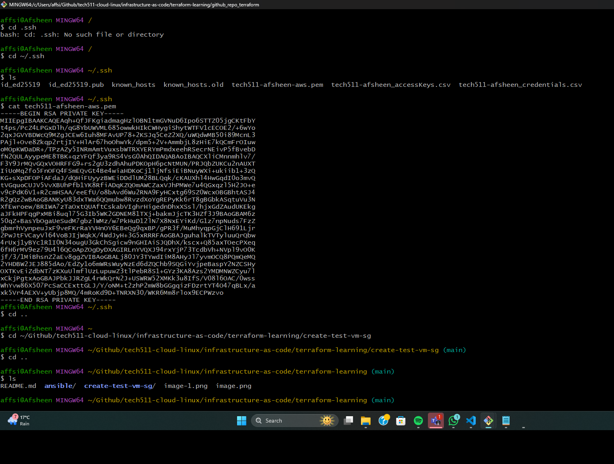
* 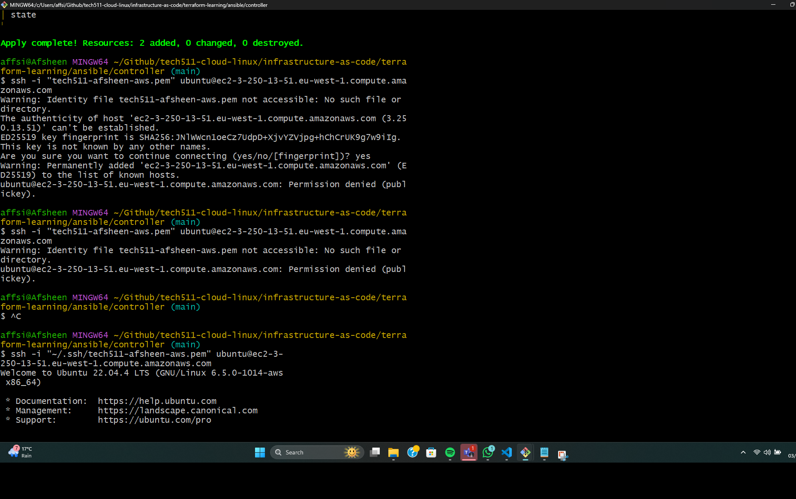
* 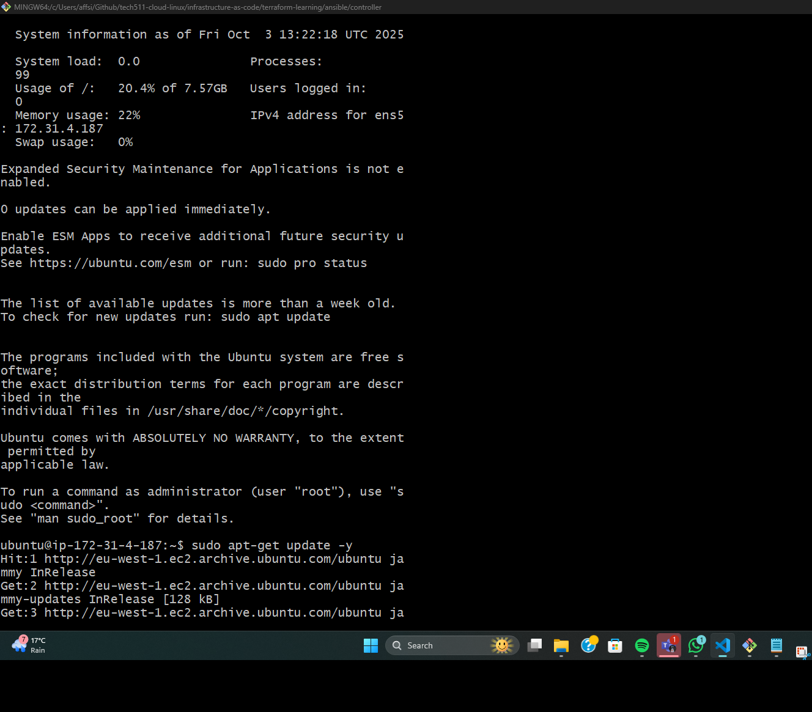
* 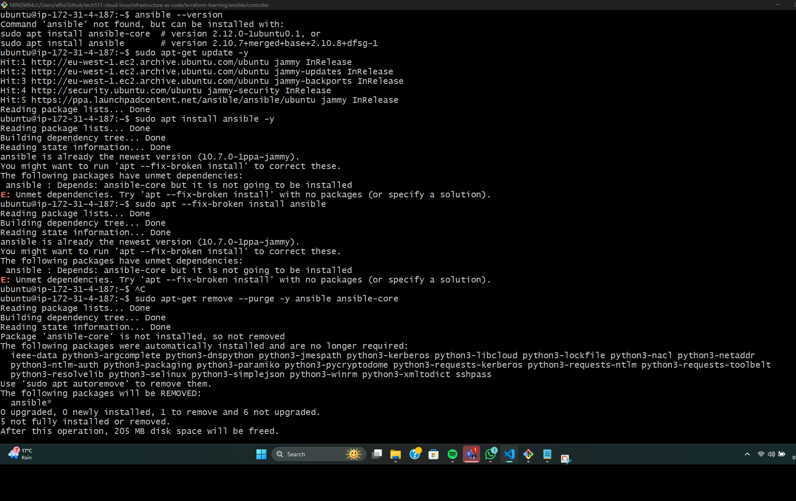
* 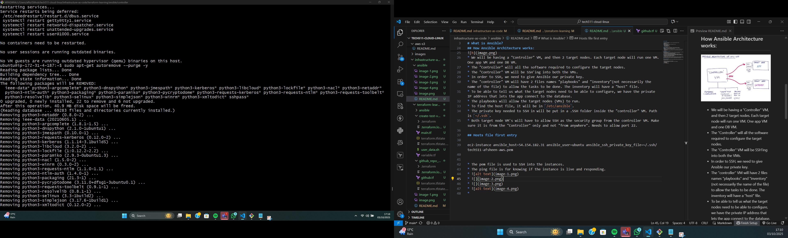
* 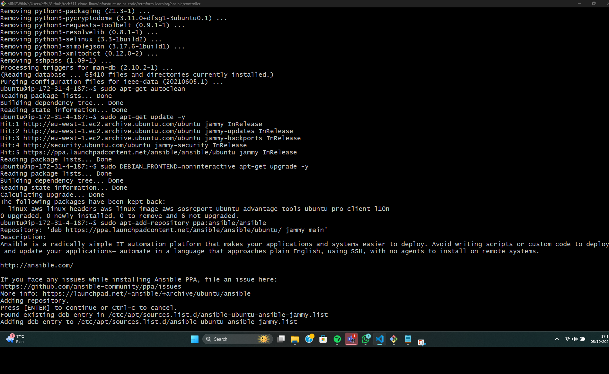
* 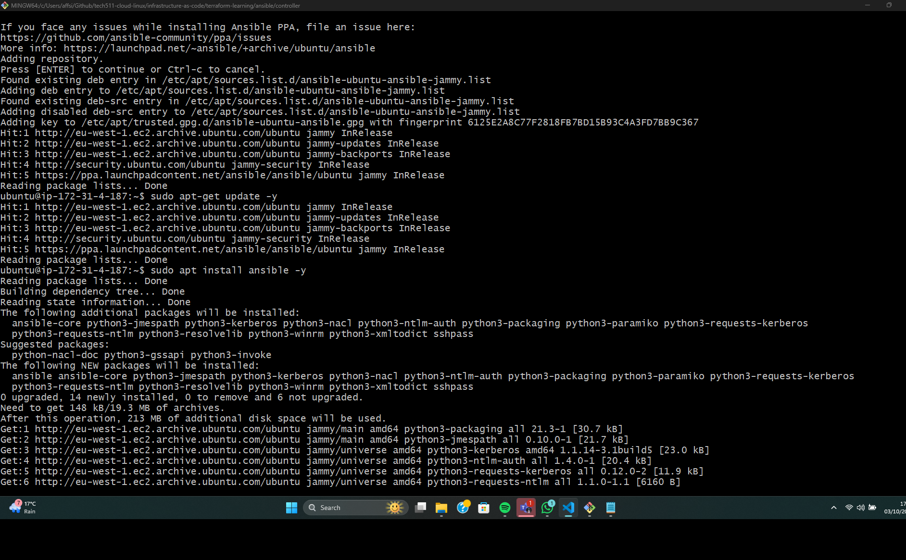
* 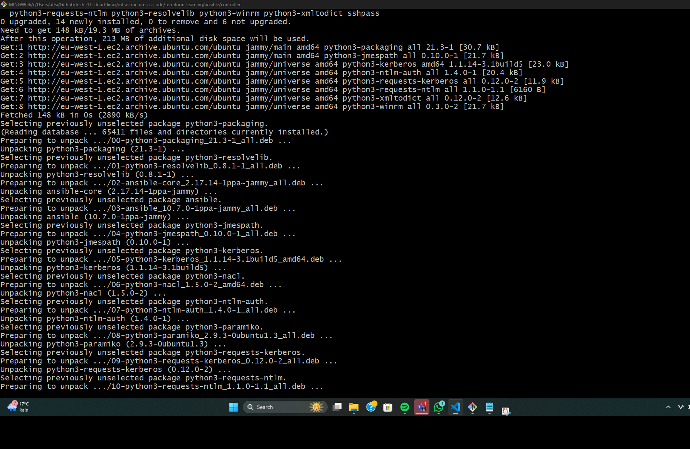
* 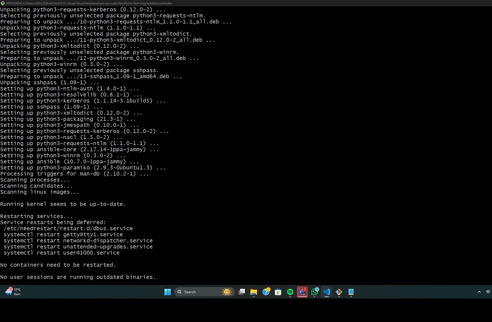
* 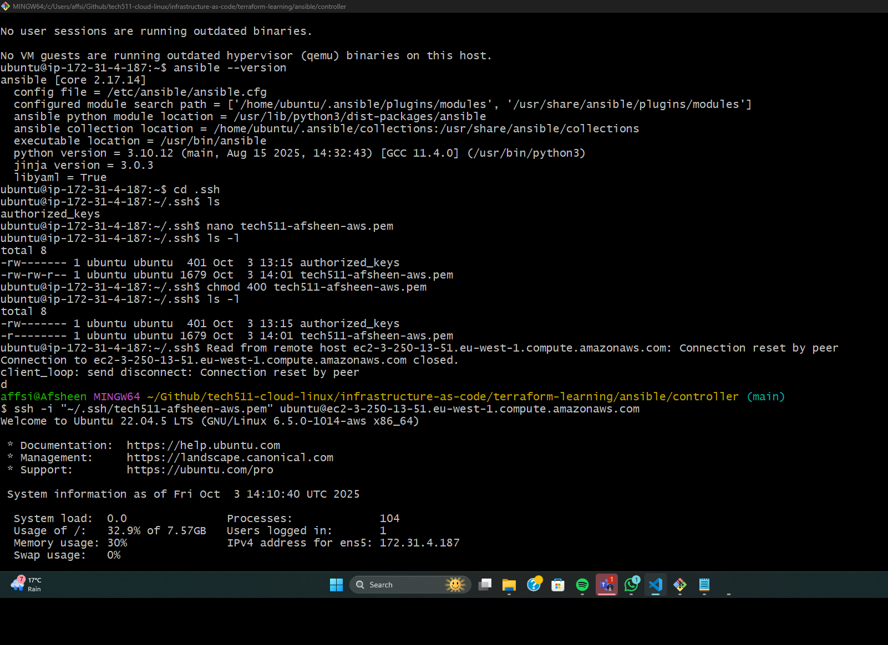
* 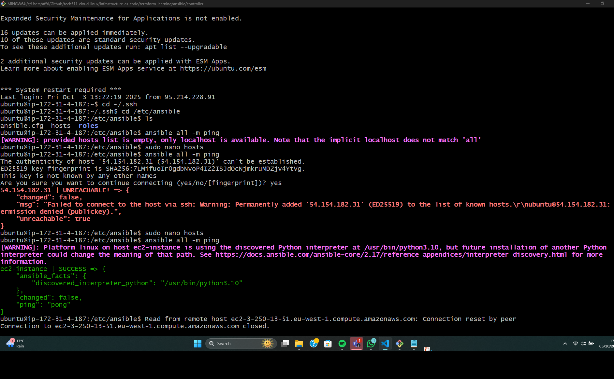
* 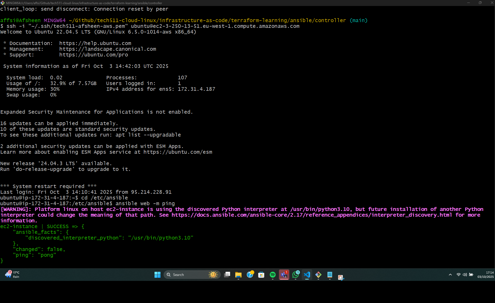
  

2nd Code along: 
* Ping is a module
* web is the group.
* Ad-hoc commands: 
* ansible web -a "uname -a" : arguement command that specifies with a module. Is the equivalent to specify  
* ansible web -m ansible.builtin.command -a "uname -a" : Does the same thing as the command before.
* ansible web -m command -a "uname-a" does the same thing as previous 2. 
* Uses default/in built in command module if module is not specified in the command. 
* If you use Shell commands for the shell module, the command would not be idempotent(get the same result each time). This means configuration, deployment, etc.
*  Have to use different modules in the commands to allow to get Ansible idempotent. 
*  Don't use shell or command modules that are not idempotent. 
*  "ansible web -a "apt-get update -y" --become": is not idempotent but updates the target node (app VM).
*  ansible web -m apt -a "update_cache=yes" --become: idempotent command that updates the target node. 
*  ansible web -m ansible.builtin.apt -a "upgrade=dist" --become: upgrades the target node.
Create a playbook:
*  Check Ansible inventory for the current inventory you have. -> ansible-inventory --list
*  Make sure you don't have nginx installed: ansible web -a "systemctl status nginx" --become
* sudo nano install_nginx 
* ansible-playbook install_nginx.yaml -> to run the yaml file command
