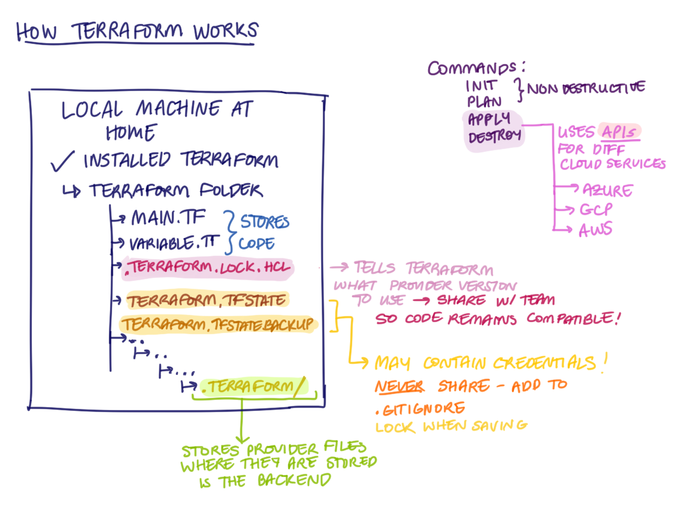
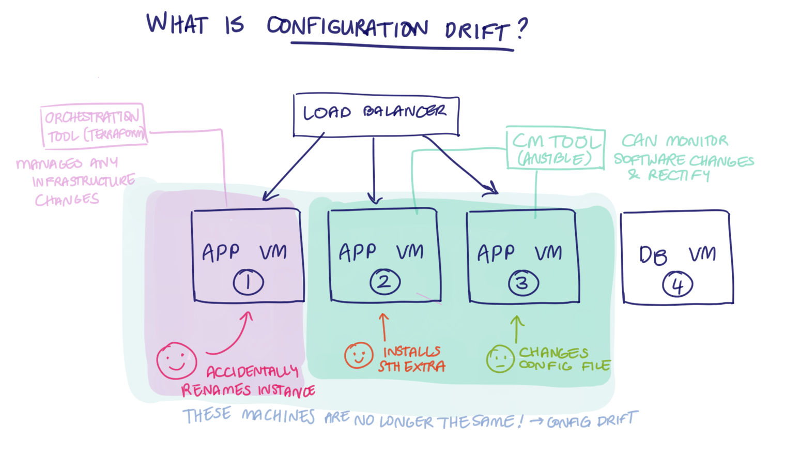

# Terrafrom learning

## Intro to Terraform

## What is Terraform? What is it used for?

* Orchestration tool
* Best for infrastructure provisioning
* Originally inspired by AWS CloudFormation
* See infrastructure as immutable (cannot be changed after its set) -> will need to reassign value if needed. Correct terminolgy is disposable.
  * Compare this to CM tools which usually see infrastructure as mutable/reusable.
* Code in Hashicorp Configuration Language (HCL) 
  * Aims to give a balance between human and machine readability.
  * HCL can be converted to JSON and vice vera

## Why use Terraform? The benefits?

* Easy to use
* Sort-of open-source. Something to do with Licence issues so many people have left it and went on to use something else.
  * Since 2023, uses Business Source License (BSL)
  * Some organisations are now moving onto using OpenTofu (an open-source drop-in).
* Declarative
    * About the destination and not the journey (Explain what you want and it will figure out the rest).
* Cloud-agnostic - can use different cloud providers
  * To support a cloud provider, you need to first download the "provider" (plug-in) for that cloud provider.
  * Each cloud vendor maintains its own "provider".
  * Expressive and extendible. Can download your own custom cloud provider if need be.

## Alternative to Terraform

* Pulimi - not declarative.
* AWS CloudFormation, GCP Deployment Manager, Azure Resource Manager (using ARM templates).
  * Cloud-specific products 

## Who is using Terraform in the industry?
1. Tech Companies and Startups:
Uber, Spotify, Airbnb, Coinbase
2. Financial Institutions (regulated industry):
JPMorgan Chase, Goldman Sachs, Capital One
3. Cloud Providers and SaaS Platforms:
AWS, Google Cloud, Salesforce
4. Media and Entertainment:
The New York Times, Netflix
5. Healthcare (regulated industry) and Life Sciences:
Philips, Cerner
6. Telecommunications:
Verizon, T-Mobile
7. Retail and E-Commerce:
Walmart, Target
8. Gaming Industry:
Electronic Arts (EA), Riot Games (they make/run League of Legends)
9. Government and Public Sector:
UK Government Digital Service (GDS), NASA
10. Consulting and Cloud Services:
Accenture, Deloitte
11. Education and Research Institutions:
Harvard University, MIT
 
## In IaC, what is orchestration? How does Terraform act as "orchestrator"?

* Process of automating and managing the entire lifecycle of infrastructure resource.
* Takes care of order in which to create/modify/destroy.

## Best practice supplying AWS credentials to Terraform

Look for credentials in this order:

1. Environment variables: AWS_ACCESS_KEY_ID and AWS_SECRET_ACCESS_KEY (okay for local use and if restricted to your user).
2. Terraform variables - should never do this because we NEVER hard-code credentials.
3. AWS CLI when you run `aws config`. (good way to do it)
4. If we use Terraform, we install it on an EC2 instance, we can then give it an IAM role. This is a set of permissions. For example, to read or have read/write persmissions to edit the VMs in that specific region. We can then give it permissions to do certain things. -> This is the best way to do it. 

How should AWS credentials never passed to Terraform?
* NEVER hard-code them - and they can never end up on a public Git Repo.

## Why use Terraform for different environments (e.g. production, testing, etc)

Examples:
* Testing env
  * Easily/quickly spin up infrastructure for testing purposes that mirror production, easily/quickly bring it down at COB.
  * Consistency between environments, reducing bugs caused by environment disrepancies.
  * Non-distraught.

## How Terraform works

* We have installed Terraform in our local machine (laptop).
* On our local machine, we have installed terraform where we have a Terraform folder.
* In our Terraform folder, we have:
  * main.tf - store code
  * variable.tf - store code
  *  terraform.lock.hcl
  *  terraform.tfstate - could have credentials and be saved with a locking system.
  *  terraform.tfstate.backup - could have credentials and be saved with a locking system.
  *  .terraform folder - stores provider files (hidden file)
*  The .terraform folder could possibly have credentials saved with a locking system.
*  The hidden files (tfstate and tfstate backup) locks the version of the provider it is currently in, otherwise updates it. 
* If you are working in a team, and you do not have the latest version, then you will need to get that or else the code will break once you run it.
*  If you are working in a team, the code needs to be in a shared space along with the state files.
*  NEVER put state files on a private/public git repo. Instead you could save it in AWS S3 but you won't have a locking system in place.

* Commands:
  * terraform init: sets up backend, and saves the state files in AWS S3 if needed. 
  * terraform plan: non-destructive. Shows the console the plan before running the code.
  * terraform destroy: destructive. Destroys/terminates the code.
  * terraform apply: destructive. Applies the changes made and runs the code if changes are made.
* The apply/destroy command can be done on AWS, Azure, GCP, while using the provider file and going through the APIs. Other tools will also go through APIs.
* AWS Console will also go through APIs.

## What is a configuration drift?

* If you change a software, then the config file is going to be responsible to it.
* However, a software that would be used to fix the config file back will all the required configurations would the Configuration Management tools (like Ansible).
* If someone accidentally renames instance, then orchestration tools would be applied here.

Task 1: Created an app VM ONLY using Terraform
* We first had to make the required instance name including the key-pair value, image name (22.04), t3.micro, set the ami and the subnet id to the default one and also created variables for credentials and put them in a separate file. 
* We made sure to set up a public ip address so that the app can be accessed easily.
* We added user data but without the DB_HOST environmental variable as we only wanted access to the app for now:
 
  `#!/bin/bash
  cd /home/ubuntu/tech511-sparta-app/app
  pm2 start app.js`
* We set the security groups to allow SSH from my IP, HTTP and port 3000 from all.
Blockers:
* One blocker I had while trying to get my app running was that the website would not work for me. There was no error message in hindsight and I had placed my security groups in correctly too. After futher investigation I found out that, I had incorrectly inserted my user data and added indentations accidentally that didn't get my app running. Once I removed my error, the app started running. 

Task 2: Created the database VM to get the /posts app running
* For this task, I needed to create another db instance with the same settings as the app one but making sure the public IP address is not made. 
* I also had to set up the db AMI making sure I am connecting the db AMI ID to my AMI ID in the main.tf file. 
* Along with the security rules, I had to make sure that I allow DB access only from the app sg.
* I had an line in the code where when both instances are made, the app VM takes the private IP address of the database and connects to the DB without me having to manually set it in. This line was: 
`user_data = templatefile("user_data.sh", {    #extract user data
        role = "app"       
        db_host = aws_instance.db_instance.private_ip //tells terraform to run the db instance first as it needs the ip address first.
        #Known as implicit dependency. If you wrote a depends_on line of code, it would be a explicit dependency.
    })`
* The templatefile takes the new private IP of the database as it creates a new one each time the instance is run/created so that the database could run. 
* Remember, manually you would make the db VM first.
Blockers:
* When I was trying to get the app and the database running, I realised that my user data had a missing " in my code. When I got that working the database started running too.

Task 3: Created the app and database VM to get the /posts page working using a custom VPC
* For this task, I needed to create a custome VPC that connects to my AMI, along with 2 subnets (one private and one public), a public route table and the internet gateway. I made it in this order. Even though Terraform takes control of the journey, for my personal understanding, I did it in this way. 
* I had to create the same security groups as both VM needed before and linked everything to its respective ID. 
* For the CIDR blocks for each subnet, the public one was 10.0.1.0/24 and the private one was 10.0.2.0/24.
* The VPC was 10.0.0.0/16.
* I made sure there was a connection the subnets had to the route table and then ran it. 

Key Notes:

* Before committing, make sure that the variables.tf file is hidden since that it has the credentials.
* Terraform is going to look at every .tf folder and run the code altogether in the current folder you're in.
* If there is ever a time, where I need to put in credentials in code, there must be another way and if need be should have encrypted files to do so.
* On our local machine, we are storing our passwords and credentials in our .SSH folder. We can have a password manager that gets saved in the browser. To implement this on a VM, we can use AWS S3 or management files to do so. 
* To share crendtials, a good way to do this is by sharing the file on the cloud.
* In our .gitignore file, we should have our tf.state files, variables.tf file and the .terraform folder as it has provider details and it also quite big and could possibly have credentials. 
* When creating the custom VPC, you need to follow the order of creating the custom VPC, so that it's easier to understand. Even though terraform takes care of the order, it is necessary for you to make sure that everything is created in order. For example, vpc, 2 subnets, route table, internet gateway.
 ~/Github/tech511-cloud-linux/infrastructure-as-code/terraform-learning/create-test-vm-sg