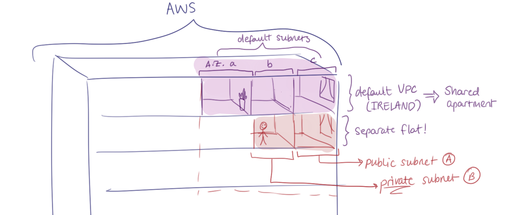
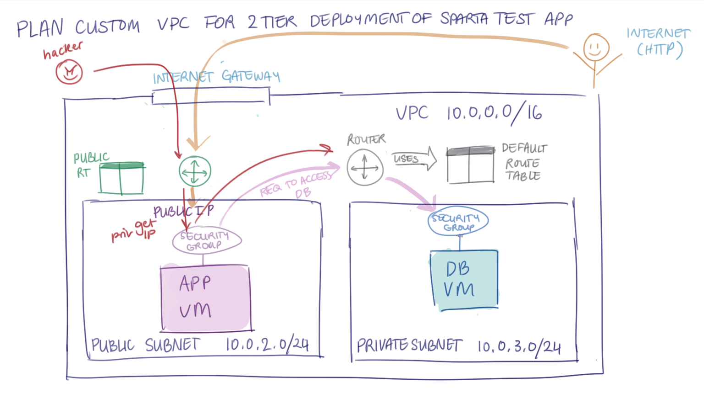

- [Securing the database in our 2-tier app deployment](#securing-the-database-in-our-2-tier-app-deployment)
  - [Introduction to Virtual Networking](#introduction-to-virtual-networking)
    - [What is a Virtual Network?](#what-is-a-virtual-network)
    - [Terminology used with virtual networks](#terminology-used-with-virtual-networks)
    - [Understanding IPv4 addresses and CIDR blocks](#understanding-ipv4-addresses-and-cidr-blocks)
    - [Understand defaults for the AWS](#understand-defaults-for-the-aws)
    - [How do VPCs work?](#how-do-vpcs-work)
    - [Plan custom VPC for 2-tier deployment of Sparta Test App](#plan-custom-vpc-for-2-tier-deployment-of-sparta-test-app)
  - [How to create a VPC](#how-to-create-a-vpc)

# Securing the database in our 2-tier app deployment
## Introduction to Virtual Networking
### What is a Virtual Network?

* A way for devices/computers running in the cloud to talk to each other. 
* Think of it a bit like an apartment.
* We setup the range of private IP addresses to be used on the network.
* You split up the space (range of private IP addresses) into one or more subnets (like rooms within the apartment).
* To protect it:
  * You can manually setup the flow of traffic around the network.
  * Firewall rules to protect network, subnets and individual devices.

### Terminology used with virtual networks

* VPC/VNet - the overall virtual network
    * AWS: VPC (Virtual Private Cloud)
    * Azure: VNET (Virtual Network)
    * GCP: VPC (Virtual Private Cloud)
* Subnet
  * Section of the network
* Firewall/security group/NSG/NCL (on AWS)
  * Rules to allow/deny traffic 
* Route table
  * Tell traffic where to go
* Peering
  * Connecting different networks together 

### Understanding IPv4 addresses and CIDR blocks

### Understand defaults for the AWS

* AWS provides a default VPCs in every region under your account. 
* This puts in our VM straight to that VPC.
* Default VPC has a default architecture and uses defaults which are permissive.

### How do VPCs work?

* Imagine you're in an apartment where AWS is the building and the floor you're living on is the sparta account.
* The building/AWS is our public cloud.
* Inside that default VPC/ default VPC (which is your shared flat), there are 3 different subnets (3 different rooms?).
* This is because we have 3 different availability zones.
* In order for you to do what you want (own security), you would want to move out into a new separate flat.
* In your own flat, you're gonna have 2 default subnets, public subnets, private subnets.
* Split the subnets into the 3 availability zones like public subnet in Zone A and private subnet in Zone B.

### Plan custom VPC for 2-tier deployment of Sparta Test App

* Overall VPC will have a private IP address that is locked. For example, in 10.0.0.0/16, the 10.0 will be locked. 
* We will have a custom VPC due to security reasons. The default VPC will not be as secure as other people that have the Sparta login with certain permissions will be able to see the database of the app.
* The virtual network will be split into 2 subnets. One private and one public.
* Public subnets will have a range of IP addresses that can range from 56 addresses. For example, an IP address of 10.0.2.0/24 will have the 10.0 locked.
* Private subnets will also have a range of 56 IP addresses and 256 machines but obv we will be only using 2. For the private subnet, we've used an IP address of 10.0.3.0/24. 
* The 24 is both IP addresses is just locking the first 2 numbers in the subnet.
* The public subnet will have the app VM and the private subnet will have the DB VM.
* The app VM will have an IP address of 10.0.2.??. Only the last part will not be locked.
* Same with the DB VM. 10.0.3.??.
* With each of these machines, there will be a firewall within them. This is the security group rules we've created.
* In order to get into these machines, there will be an Internet Gateway.
* The Internet Gateway is the way to enter the network of our VM. We will have traffic coming in from the internet on HTTP. May also need to SSH in. It will be the same thing.
* In order the direct the traffic to the correct destination, we need to set up a route table to direct the path.
* A default route table will be created for us already which means we only need to create one.
* A router uses a route table to direct traffic.
* The DEFAULT route table will allow internal traffic so that the app VM and the DB VM would need to talk to each other. 
* The traffic that involves the communication between the app and the DB is legitimate; meaning the app talking to the DB.
* The app is going to request the traffic to go to the DB, which is going to go to the router which then goes to the DB.
* The DB is then going to respond through data back to the app. 
* Dangerous traffic will include traffic coming from the internet that is easily accessing the DB.
* To control what comes into the DB, we need a CUSTOM public route table that allows traffic to enter the public subnet.
* A router will be used in the background to direct the public traffic to the public subnet. 
* The traffic coming in from the Internet/HTTP flows through the INTERNET GATEWAY, then flows through the router which uses the public CUSTOM route table to then the public subnet. 
* This is how the traffic flows into the app VM.
* There is a public IP address that is in the app VM. This is how the internet flows traffic into the app VM and gets the app starting.
* The internal traffic that it going into the DB will not be going through the public IP.
* The database will not have a public IP address at all for security reasons.

## How to create a VPC
1. Create A VPC by searching them on the search bar.
2. Click 'VPC only'
3. Type in your VPC name: tech511-afsheen-2tier-first-vpc
4. Keep it as "IPv4 CIDR manual input"
5. Set the IPv4 CIDR as: 10.0.0.0/16.
6. Keep it as "No IPv6 CIDR block".
7. The tag is already filled in as "Name" for key and the VPC name as the value.
8. Click "Create VPC".
9. The Route 53 Resolver... error is normal.
10. Go on Subnets on the left menu just below 'Your VPCs'.
11. Click "Create Subnet".
12. Select the VPC name you've just created.
13. Create a public and private subnet.
14. Subnet 1 is named "tech511-afsheen-public-subnet".
15. Each subnet will have different zones of the availiability zones but from the same location, i.e. Ireland.
16. The public subnet was chosen with Zone A.
17. The IPv4 VPC CIDR block was 10.0.0.0/16 (same as VPC).
18. The IPv4 subnet CIDR block was 10.0.2.0/24.
19. Click "Add new subnet" and make the private one.
20. Name is "tech511-afsheen-private-subnet".
21. Availability is Zone B in Ireland.
22. The IPv4 VPC CIDR block was 10.0.0.0/16 (same as VPC).
23. The IP4 subnet CIDR block was 10.0.3.0/24.
24. Click orange "Create Subnet".
25. Click "Internet Gateway" from the menu on the left and then click the " Create Internet Gateway" in orange.
26. Name it "tech511-afsheen-2tier-first-vpc-ig".
27. Click the orange "Create internet gateway".
28. The "Name" tag will already be made for you. 
29. Then find the internet gateway you just made, you can see that it is currently "detached".
30. Click on the internet gateway, go on "Actions", then press "Attach to VPC".
31. Click your VPC and click the orange "Attach internet gateway".
32. Go to "Route table" on the left.
33. Click "Create route table". This is the public DEFAULT one we are making.
34. Name it "tech511-afsheen-2tier-first-vpc-public-rt".
35. Associate with our already made VPC.
36. Tag is already there. Click "Create route table".
37. Once you go to the next screen, which is the information about the route table, click the "subnet associations" tab and then click "edit subnet associations".
38. Pick your public subnet ONLY. Then press "Save associations".
39. Once you're done, you go back to the default screen of the route table.
40. Go to the "Routes" tab down below and click "edit routes". 
41. Click "add route".
42. On the "destination" column, click "0.0.0.0/0. This is because we don't know what IP address the traffic going to the public subnet will be.
43. The target will be "Internet Gateway".
44. Then connect it to your internet gateway.
45. Then press "save changes".
46. Go on "Your VPCs", then find your VPC. Then scroll down and you can see the "Resource map". Make sure everything is there. Your VPC, 2 subnets (private and public), 2 route tables (one default and one custom) and then the internet gateway.
47. Go on EC2, AMIs, find your app AMI, "tech511-afsheen-sparta-app-ready-to-run-database", click "launch instance from AMI".
48. Name the instance "tech511-afsheen-in-custom-vpc-sparta-app-db".
49. Find your key pair.
50. You need to make a new security group so name it "tech511-afsheen-2tier-vpc-sparta-app-db-allow-SSH-MongoDB".
51.  Go down and allow SSH and add another security group rule. Choose Custom TCP, and change the port to 27017, source from "Anywhere".
52.  Then go up to "network settings" and click "edit" to change the default VPC to your one. You also need to change the subnet.
53. Choose your VPC and make sure it's the private subnet.
54. Disable the public IP address.
55. Click "launch instance".
56. Then go to the AMIs tab, and find your "ready to run app" AMI.
57. Then click "launch instance from AMI" and name it "tech511-afsheen-in-custom-vpc-sparta-app".
58. Fill in key-pair by selecting yours.
59. Edit network settings by clicking your VPC, getting the public subnet up, enable the public IP address and then create a new security group.
60. Name it "tech511-afsheen-2tier-vpc-sparta-app-allow-SSH-HTTP".
61. We will not need SSH in production level. Just using it currently for testing purposes.
62. Keep the SSH rule in there for now. Add another security rule.
63. Click HTTP and allowing it from "Anywhere".
64. Add user data:
   #!/bin/bash
   cd home/ubuntu/tech511-sparta-app/app
   export DB_HOST=mongodb://<privateIPofDBVM>:27017/posts
   pm2 start app.js 
65. The IP address will start with 10.0.3.??.
66. Launch Instance!!
67. Click the ID, and then click the public IP address of the app VM.
68. Hopefully the app and the posts page starts running.
69. Cleaning up:
    * Remove the VMs in the VPC
    * Remove the security groups associated with the VPC
    * Remove the VPC:
      * When deleting the VPC it should report that it will also delete these 4 resources:
        * the Internet gateway
        * the public route table
        * the private subnet
        * the public subnet

* To login to the DB VM, we can do so with the app VM. This is by SSH'ing into the app VM. We would use the default/private DB to enter the DB. This is because the route table handles the connection between the app and the VM. Manages internal connection between VPCs.
* login to the DB VM using the private IP address using the SSH private key from the app VM into the DB VM.
* You can autoscale manually into another VM. 