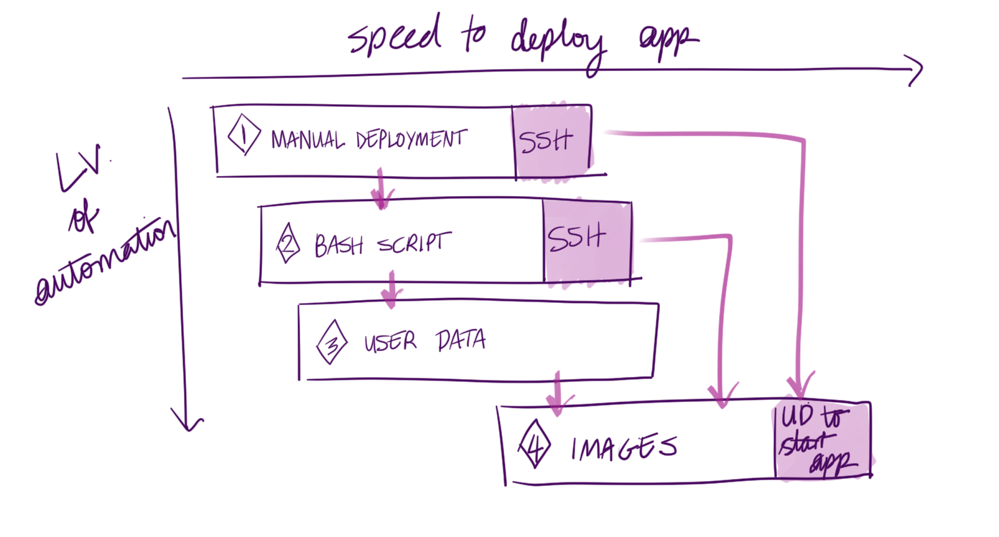
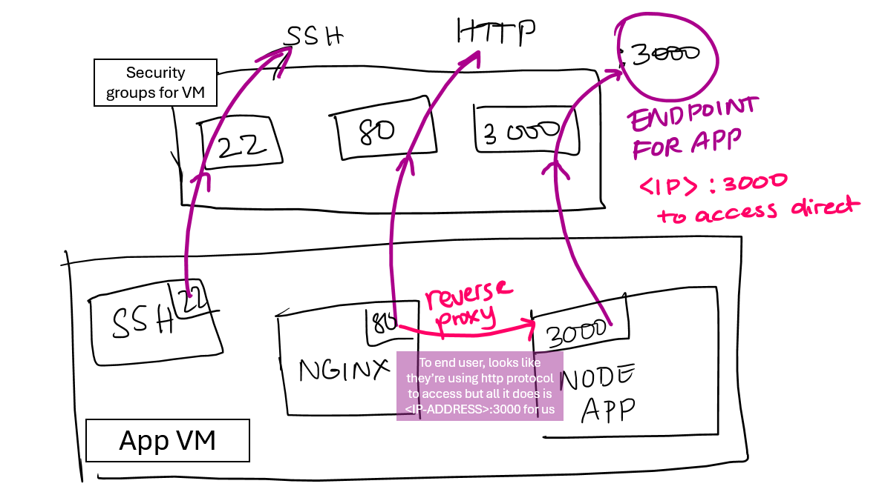

# add sed to replace file with another file. E.g. ip address

#For reverse proxy app:

* Make sure you are in the correct file path
* When you have to start the instance again, the IP address changes. This means you need to change the DB_HOST by entering this command: export DB_HOST=mongodb://34.245.99.163:27017/posts

* After that, type this: sudo sed -i 's|try_files.*|proxy_pass http://127.0.0.1. This replaces the port 3000 with just the IP address.
  
* Then do sudo systemctl restart nginx. This restart the app after all the updates.

* Finally, do npm install to get the database connected and the records seeded again.

* pm2 start app.js to start app and refresh the page. 

 ## Automation Notes:

* When creating images, remember it is going to be stored on the disk. 
* When an AMI get created, in order for the database to work, it temporatily shuts down the VM and then opens it again. 
* This happens when it copies the disk. 
* We get a 502 gateway error beacuse the port 3000 is trying to run the app but the app is not working right now. So the nginx which is working in port 80, transfers traffic to port 3000 during the reverse proxy, But since the app is not running, we get the gateway error. 

----------------------------------------------------------------------------------------------------------------------

AMI User data:
#!/bin/bash

cd /home/ubuntu/repo/app

export DB_HOST=mongodb://publicIP_DB/posts

pm2 start app.js

# --------------------------------------------------------------------------------------------------------------------

## Why do we use pm2?
pm2 lets the app run similiar to npm start or node app.js. However, pm2 allows more functionality such as stopping or restarting the app. 

## Why do we use nginx?
nginx redirects incoming traffic to no port. It's used only for reverse proxy.

* When running both app and db prov scripts, make sure to get the db running first. This is because you need to be able to get the database running and active before getting the app to run. This is so that the /posts page get to start.
* When making the environmental variable persistent, make sure you add the private IP of the DB VM. 
* nginx redirects incoming traffic to no port. It's used only for reverse proxy.
* pm2 lets the app run similiar to npm start or node app.js. However, pm2 allows more functionality such as stopping or restarting the app. 

## Levels of Deployment

* Manual deployment ensures running pm2 to make the app run in the background. 

* Second stage ensures running the bash scripts; i.e running the app manually. 

* Third stage is User data. To make sure user data is run, we don't need to put SSH in first. 

* The advantage of entering user data with no SSH ensures that we no longer have to manually enter SSH in and can still run our Bash scripts. Because of this, as soon as the VM launches, and the OS starts up for the first time, it runs the user data. 

* Each stage saves time and gets the app running quicker that the last stage.

* Stage 4 is the use of Images (AMI). This is a set of files/folders, OS, that get copied and pasted to the disk of our VM. During this stage, we also need a little bit of user data to configure the IP to get to the database and then to actually pm2 (only for the app). 

* When we create an image from a VM, we are copying what's on the disk into that image. 

* Note: We select a 22.04 version of ubuntu as our image.  

* When we make an app VM, we get a disk that has all our files, OS. Now when we create an app AMI, we copy what's on the already made disk into the AMI.

* When we create a VM from this AMI, we get everything from the custom AMI and the original AMI into the new disk of the VM.

* When this new VM runs for the first time, nginx is going to be started automatically. The reverse proxy is already going be configured.

* Could manually deploy the app and then create an AMI. 

* Could also run the bash scripts and then create an AMI. 

* Having an AMI would save us from, having to manually deploy every time; i.e. get the app running.

## Intro into the app

The app runs on port 3000 to access the launch page with a dummy /posts page seeded by MongoDB.

nginx is used as a reverse proxy to directly paste the IP address into the web browser: 

If 502 error occurs, it means nginx is correctly set up as it is accessible by http protocol, there would be issues concerning npm install or launching the node app from node.js.

When accessing the app, it must be considered how long you give the page to load, as the app still needs to set up. 