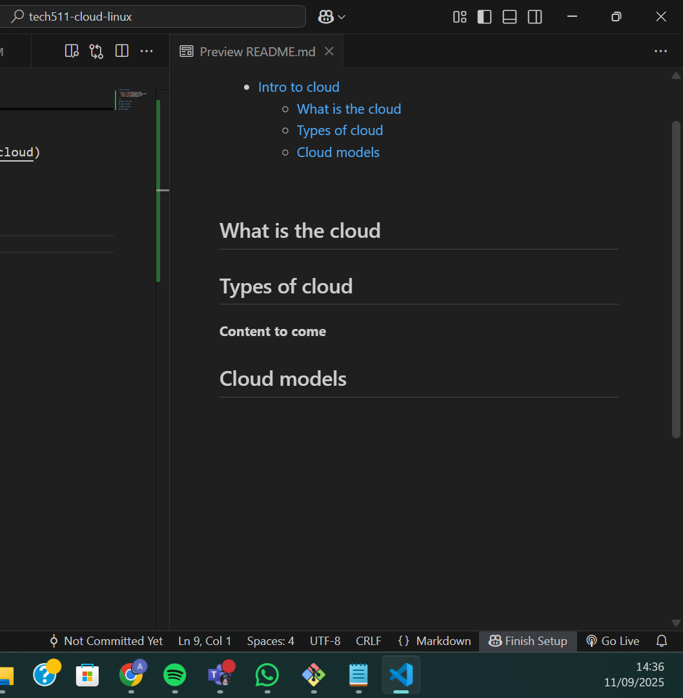

# Intro to cloud

- [Intro to cloud](#intro-to-cloud)
  - [GitHub Toolbar](#github-toolbar)
  - [What is the cloud](#what-is-the-cloud)
  - [Types of cloud](#types-of-cloud)
  - [Cloud models](#cloud-models)

 

## GitHub Toolbar

## What is the cloud

## Types of cloud

**Content to come**

## Cloud models

